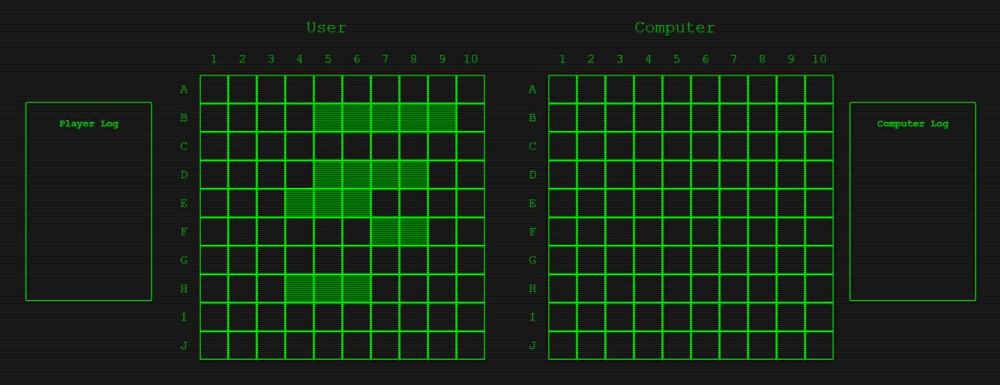

This is my version of Battleship for the [Odin Project](https://www.TheOdinProject.com) 

I used Webpack, jest, eslint, babel and prettier.

Functionality for the user to place and rotate their ships.

The computer will choose a spot to attack on the playerboard at random and if a hit occurs, the computer will attack adjacent squares.

There are logs for the player and computer to report what square was attacked and whether or not it was a hit or a miss.

There's also mobile styling - Still a work in progress and the CSS overall may be refactored for a more standardized look.

Code will be refactored into react.